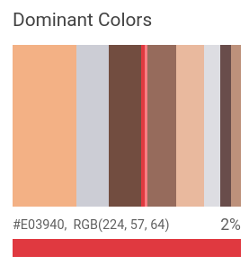

# color-detection
Detect Primary Colors in images using Python and Sci-kit Image. A Jupiter Notebook tutorial.

#### *Introduction*

I recently started a journey through learning computer vision, mainly with Open-CV and Scikit-image. My wife works as a dental hygienist and makes a lot of teeth whitenings. This made me think that it could be cool to have a simple application that given an image can detect the main colors.

Then, after some research I tumbled on the Google Vision API. A nice service from Google, I have to say: given an input image you can perform a request for different kind of functions. You can detect faces, obatain face landmarks and ... the main colors!

If you're curious, here is the link <a href="https://cloud.google.com/vision/docs/detecting-properties">[Color Detection with Vision API]</a>. Here is a picture of the output of the API request:

***

***

But I am an italian physicist. Since I am italian I don't want to pay Google for something that maybe I can do myself. Since I am also a physicist, I want to know what's going on under the wood. The mix obliges me to write my own version of color detection. 

It happens that this can be easily done wit Scikit-image package. I'll try to explain the details in this Jupyter Notebook.
