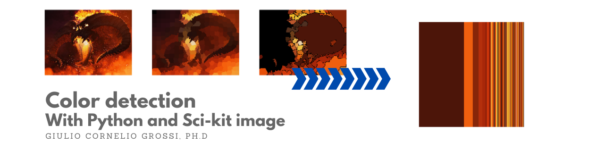

# color-detection
Detect Primary Colors in images using Python and Sci-kit Image. A Jupiter Notebook tutorial.

***



#### *Introduction*

I recently started a journey through learning computer vision, mainly with Open-CV and Scikit-image. My wife works as a dental hygienist and makes a lot of teeth whitenings. This made me think that it could be cool to have a simple application that given an image can detect the main colors.

Then, after some research I tumbled on the Google Vision API. A nice service from Google, I have to say: given an input image you can perform a request for different kind of functions. You can detect faces, obatain face landmarks and ... the main colors!

If you're curious, here is the link <a href="https://cloud.google.com/vision/docs/detecting-properties">[Color Detection with Vision API]</a>. Here is a picture of the output of the API request:

***


***

But I am an italian physicist. Since I am italian I don't want to pay Google for something that maybe I can do myself. Since I am also a physicist, I want to know what's going on under the wood. The mix obliges me to write my own version of color detection. 

It happens that this can be easily done wit Scikit-image package. I'll try to explain the details in this Jupyter Notebook.

#### *Imports*

```python
from skimage import segmentation
from skimage.future import graph
import numpy as np
import os
import cv2
import json
import plotly.express as px
from plotly.subplots import make_subplots
import plotly.graph_objects as go
```
#### *Read input image*

I do this with Open-CV ```imread``` function. Open-CV loads images in BGR format, so an extra step is required to convert it to RGB, the input format for Scikit-image functions.

If the image is too big, the whole processing step of color detection can be computing costly, so I advice to write here a little helper that resizes the image if too big. 500x500 pixels is a good size for precision vs. speed balance.

And since I am a nerd italian physicist with a Lord of the Rings obsession, we are going to color segment a Balrog of Morgoth. We refer to Saruman's words in the Peter Jackson's movie:

> *Moria... You fear to go into those mines. The dwarves delved too greedily and too deep. You know what they awoke in the darkness of Khazad-dum... shadow and flame.*

Too see how much dark and how much flames are in the image!

```python
# read on input image using cv2
filename=os.path.join(os.getcwd(),"images","balrog.jpg")
img_bgr = cv2.imread(filename)

# convert rgb->bgr (a cv2 speciality)
img=cv2.cvtColor(img_bgr, cv2.COLOR_BGR2RGB)

# show the input image
fig = make_subplots(rows=1, cols=1)
fig.add_trace(px.imshow(img).data[0],row=1, col=1)
fig.update_yaxes(showticklabels=False)
fig.update_xaxes(showticklabels=False)
fig.show()
```

#### *Hack the sci-kit image function 'color.label2rgb()'*
<a href="https://github.com/scikit-image/scikit-image/blob/main/skimage/color/colorlabel.py#L74-L124">[source]</a>

To make the job done, we are going to use a sci-kit image implementation of the SLIC (Simple Linear Iterative Clustering) algorithm.

I am not going in the deep details of the algorithm, but I'll point you to a quick blogpost regarding it <a href="https://darshita1405.medium.com/superpixels-and-slic-6b2d8a6e4f08">[SLIC]</a>. The algorithm performs a k-means clustering in the (l*,a*,b*,x,y) color+image plane space, returning an image with "superpixels" (bigger pixels that share the same color-space characteristics).

The scki-kit image function  ```segmentation.slic()``` that we are goin to use, returns a series of labels (i.e. the cluster number to which each pixel belongs). These labels are then used to:
- create a mask for each label
- apply the mask to the original image
- calculate the mean color
- set the pixels of the original image to the mean color

All of this is done by the ```color.label2rgb()``` function od sci-kit image, that we are going to hack. Why? because we need to extract some information from it. We need not only the resulting image but also the mean colors and the number of pixels corresponding to each color to calculate the color prevalence (in %). The following function ```color_masks()``` is the modified version we need. 

The output is a color dictionary with the lists of (r,g,b) mean colors and the number of pixels corresponding to each.

```python
def color_masks(label_field, image, bg_label=0, bg_color=(0, 0, 0)):
    """Visualise each segment in `label_field` with its mean color in `image`.
    Parameters
    ----------
    label_field : array of int
        A segmentation of an image.
    image : array, shape ``label_field.shape + (3,)``
        A color image of the same spatial shape as `label_field`.
    bg_label : int, optional
        A value in `label_field` to be treated as background.
    bg_color : 3-tuple of int, optional
        The color for the background label
    Returns
    -------
    out : array, same shape and type as `image`
        The output visualization.
    """
    out = np.zeros(label_field.shape + (3,), dtype=image.dtype)
    labels = np.unique(label_field)
    bg = (labels == bg_label)
    if bg.any():
        labels = labels[labels != bg_label]
        mask = (label_field == bg_label).nonzero()
        out[mask] = bg_color
    
    color_info={"color":[],"npixels":[]}
    
    for label in labels:
        mask = (label_field == label).nonzero()
        color = image[mask].mean(axis=0)
        out[mask] = color
        color_info["color"].append(color)
        color_info["npixels"].append(image[mask].shape[0])
    
    color_info["image"] = out
    return color_info
    
 ```
    
#### *Function to construct the colormap*

We then define a function to contruct the colormap that returns a tuple color (r,g,b), frequency. There is the possibility to sort the colors by frequency in descending order.

```python
def get_colormap(color_dict,sort=False):
    # sort the number of pixels for each color
    # if sort bool=True else pass the dictionary
    npixels=sorted(color_dict["npixels"],reverse=True) if sort else color_dict["npixels"]

    # initialize a list for the colormap
    colormap = []

    # calculate total pixels for normalization
    pxtot = sum(npixels)

    for i,npx in enumerate(npixels):
        # get sorted index if bool sort=True
        # else get normal index
        idx = color_dict["npixels"].index(npx) if sort else i
    
        # obtain the corresponding
        # color and frequency
        c = color_dict["color"][idx]
        f = color_dict["npixels"][idx]/pxtot
    
        # push a tuple in the color map with
        # (color, frequency)
        colormap.append((c,f))
        
    return colormap
 ````
 
 #### *Functions to create colormap visualizations in Plotly*

We then create the visualisations using plotly library. 

```make_color_plot()```: we initialize a numpy array 1000x1000x3 to hold the colors. We then loop over the colors, and set a slice of width proportional to the frequency equal to the color value. In this way we can reproduce the nice Google Vision API grid plot I showed before.

```make_bar_chart()```: we create also a simpler bar chart with the top-ten colors and their respective fequencies.

````python
def make_color_plot(colormap,h=1000,w=1000):
    # create a sliced chart with 
    # all the detected colors
    
    # initialize the x-coordinate
    # and bin-width
    x = bw = 0
    
    # initialize a np array with h,w
    colgrid = np.zeros((h,w,3), dtype='uint8')
    
    # loop on colormap elements
    for cm in colormap:
        # 0th component is the color (r,g,b)
        # 1st component is the frequency
        c,f = cm[0],cm[1]
        # the bin width is proportional
        # to the % frequency of the color
        bw=round(w*f)
        # make a slice h,binwidth
        # with color c
        colgrid[:,x:x+bw] = c
        # increment the x-coordinate
        x+=bw
    
    # plot
    fig = px.imshow(colgrid)
    fig.update_xaxes(showticklabels=False)
    fig.update_yaxes(showticklabels=False)
    fig.show()
    
    return
    
    def make_bar_chart(colormap,topn=10):
    # create a barchart with the top n colors
    # in order of presence
    
    # create a list of 'rgb(r,g,b)' strings
    # 0th component of colormap is (r,g,b)
    rgb = list(map(lambda c: "rgb({},{},{})".format(int(c[0][0]),int(c[0][1]),int(c[0][2])),colormap))
    
    # initialize figure
    fig = go.Figure()
    
    # loop on the first top n elements 
    # of the colormap
    for i,c in enumerate(colormap[:topn]):
        # add a bar chart with y = frequency
        # x = 'r,g,b' 
        # marker color = (r,g,b)
        fig.add_trace(go.Bar(
            x=[rgb[i]],
            y=[c[1]*100],
            name='',
            marker_color=rgb[i]
        ))
        
    # plot figure
    fig.update_layout(showlegend=False, 
                      yaxis=dict(title='[%]'),
                      plot_bgcolor='rgb(255,255,255)')
    fig.show()
    
    return
    
 ````
 #### *Clustering pixels*

It's now time to use the SLIC alogorithm provided by Sci-kit image, along with the hacked function we defined, to obtain the color information we need for our analysis plotting. 

The ```n_segments``` parameter is the actual number of labels in which the image should be clustered, while the ```compactness``` parameter balances the importance given to color distance versus spatial distance. The higher the compactness the more importance is given to spatial proximity.

These parameters should be treated as model's hyperparameters. Given the target result they need to be tweaked by trying different combinations.

````python
# get the labels corresponding to the clustered pixels
labels1 = segmentation.slic(img, compactness=30, n_segments=300)

# process the labels to obtain the
# processed image and color information
color_info = color_masks(labels1, img)
out1 = color_info["image"]

# N.B orginal Sci-kit image function
#out1 = color.label2rgb(labels1, img, kind='avg')
````

#### *Create Region Adjiacency Graph (RAG)*

We also provide a second processing step, to further segment the image in even less colors. Given the input image and the color labels, Sci-kit image package provides a method to create a *Region Adjiaceny Graph (RAG).* It is a graph object where each node of the graph represents a region of the image with the same color labels, while the weight of each node represents the euclidean distance between the two regions.

The function ```cut_threshold()``` creates a new set of labels by combining the regions with the weights less than a threshold value. These labels can be again used in our hacked function to get a new mask and colormap for the image.

The threshold value should again be considered as an hyperparameter to be optimized based on the target result.

````python
# create a RAG
g = graph.rag_mean_color(img, labels1)

# merge pixels with mean color distance < threshold
labels2 = graph.cut_threshold(labels1, g, 20)

# process the labels to obtain the
# processed image and color information
color_info2 = color_masks(labels2, img)
out2 = color_info2["image"]
out2 = segmentation.mark_boundaries(out2, labels2, (0, 0, 0))

# N.B orginal Sci-kit image function
#out2 = color.label2rgb(labels2, img, kind='avg')
````

#### *Get colormap and plot*

we can now move on to the actual plotting of our processed image by retrieving the colormap and using our plotting helper functions defined before.

As You can see the image is mostly black/brown (for the shadow), orange/red (for the flames).

````python
colormap = get_colormap(color_info2,sort=True)
make_color_plot(colormap)
make_bar_chart(colormap)
````

#### *Show the processed images*

We can also show the image in the processing step. You can see the nice "Impressionist" style we obtain, of course losing some detail of the image. A nice romantic interpretation of this ancient demon that perfectly represents my love for the Lord of the Rings!

````python
fig = make_subplots(rows=1, cols=3)
fig.add_trace(px.imshow(img).data[0],row=1, col=1)
fig.add_trace(px.imshow(out1).data[0],row=1, col=2)
fig.add_trace(px.imshow(out2).data[0],row=1, col=3)
fig.update_xaxes(showticklabels=False)
fig.update_yaxes(showticklabels=False)
fig.show()
````

I hope you enjoyed this Notebook and if you arrived till the end, Congratulations! 

You delved too greedily and too deep into the roots of Python and Computer Vision you awakened a Balrog! A step forward to became a servant of the secret fire, and to hold the flame of Anor!
